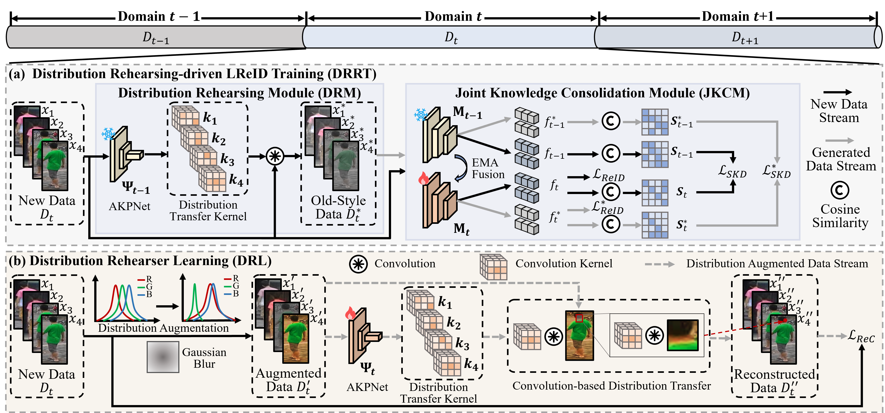
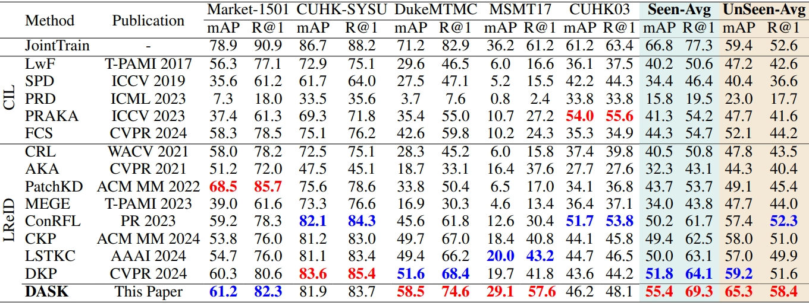

# [AAAI2025] DASK: Distribution Rehearsing via Adaptive Style Kernel Learning for Exemplar-Free Lifelong Person Re-Identification 
The *official* repository for  [DASK: Distribution Rehearsing via Adaptive Style Kernel Learning for Exemplar-Free Lifelong Person Re-Identification](https://aaai.org/wp-content/uploads/2024/02/AAAI-24_Main_2024-02-01.pdf).




## Installation
```shell
conda create -n IRL python=3.7
conda activate IRL
pip install torch==1.13.1+cu117 torchvision==0.14.1+cu117 torchaudio==0.13.1 --extra-index-url https://download.pytorch.org/whl/cu117
pip install -r requirement.txt
```
## Prepare Datasets
Download the person re-identification datasets [Market-1501](https://drive.google.com/file/d/0B8-rUzbwVRk0c054eEozWG9COHM/view), [MSMT17](http://www.pkuvmc.com/dataset.html), [CUHK03](https://github.com/zhunzhong07/person-re-ranking/tree/master/evaluation/data/CUHK03), [SenseReID](https://drive.google.com/file/d/0B56OfSrVI8hubVJLTzkwV2VaOWM/view?resourcekey=0-PKtdd5m_Jatmi2n9Kb_gFQ). Other datasets can be prepared following [Torchreid_Datasets_Doc](https://kaiyangzhou.github.io/deep-person-reid/datasets.html) and [light-reid](https://github.com/wangguanan/light-reid).
Then unzip them and rename them under the directory like
```
PRID
├── CUHK01
│   └──..
├── CUHK02
│   └──..
├── CUHK03
│   └──..
├── CUHK-SYSU
│   └──..
├── DukeMTMC-reID
│   └──..
├── grid
│   └──..
├── i-LIDS_Pedestrain
│   └──..
├── MSMT17_V2
│   └──..
├── Market-1501
│   └──..
├── prid2011
│   └──..
├── SenseReID
│   └──..
└── viper
    └──..
```
## Quick Start
### Training Distribution Rehearser Learning (DRL)
```shell
`CUDA_VISIBLE_DEVICES=0 python train_rehearser.py --logs-dir rehearser_pretrain_learn_kernel_c1-g1_mobilenet-v3 --color_style rgb --mobile --n_kernel 1 --groups 1 --learn_kernel --data-dir /path/to/PRID`
```
Note that, during the training of AKPNet for each dataset, the model is re-initialized. This ensures that the obtained models can be utilized for different training orders without the risk of data leakage.

### Training Distribution Rehearsing-driven LReID Training (DRRT)
Training + evaluation:
```shell
`CUDA_VISIBLE_DEVICES=0 python continual_train.py --mobile --logs-dir /LReID/Model/Save/Path --data-dir /path/to/PRID/Benchmark` 
```

Evaluation from checkpoint:
```shell
`CUDA_VISIBLE_DEVICES=0 python continual_train.py --mobile --data-dir /path/to/PRID --test_folder /LReID/Model/Save/Path --evaluate`
```

## Results
The following results were obtained with a single NVIDIA 4090 GPU:



## Citation
If you find this code useful for your research, please cite our paper.

[1] Kunlun Xu, Chenghao Jiang, Peixi Xiong, Yuxin Peng, and Jiahuan Zhou. DASK: Distribution Rehearsing via Adaptive Style Kernel Learning for Exemplar-Free Lifelong Person Re-Identification[C]//Proceedings of the AAAI conference on artificial intelligence. 2025. 

## Acknowledgement
Our code is based on the PyTorch implementation of [LSTKC](https://github.com/zhoujiahuan1991/AAAI2024-LSTKC) and [CoP](https://github.com/vimar-gu/ColorPromptReID).

## Contact

For any questions, feel free to contact us (xkl@stu.pku.edu.cn).

Welcome to our [Laboratory Homepage](http://www.icst.pku.edu.cn/mipl/home/) and [OV<sup>3</sup> Lab](https://zhoujiahuan1991.github.io/) for more information about our papers, source codes, and datasets.

